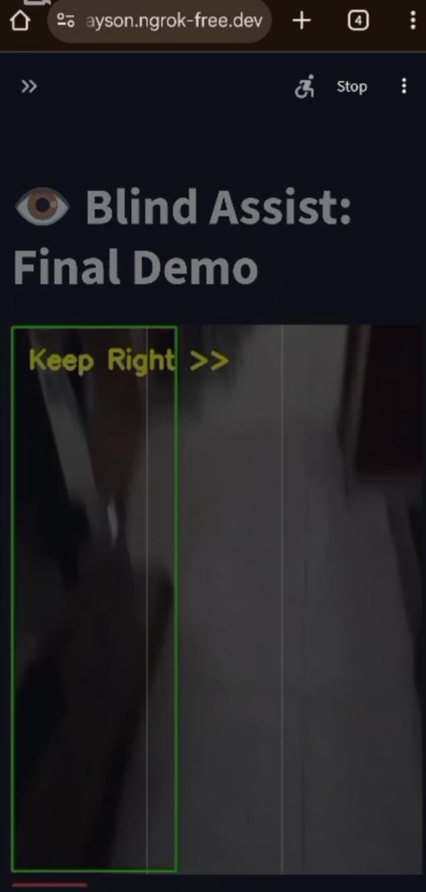
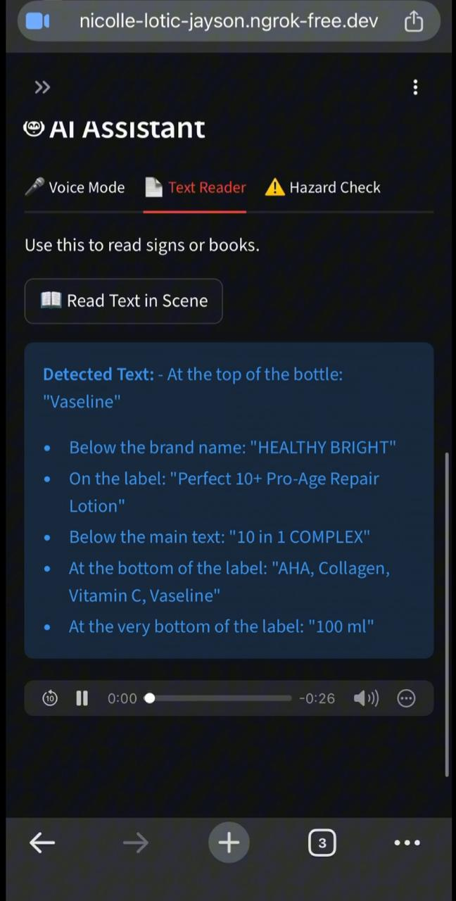

# Blind Assist AI

A multimodal AI assistant designed to aid visually impaired users with real-time navigation, object detection, and hazard warnings. The system integrates computer vision (YOLOv8) and Visual Question Answering (Moondream2) to provide auditory feedback.


##  Key Features

* **Real-Time Navigation:** Detects obstacles and provides clear "Stop", "Move Left", or "Move Right" audio cues using a custom Zone Logic algorithm.
* * **Real-Time Question Answering:** Answer about the environment dynamically.
* **Hazard Detection (VQA):** Uses a Vision-Language Model (Moondream2) to identify complex hazards like potholes, staircases, and wet floors.
* **Voice Assistant:** Integrated Whisper (STT) and gTTS (TTS) allow users to ask questions about their surroundings verbally.
* **Ultra-Lite Mode:** Optimized frame skipping and resource management to run on low-bandwidth connections.

##  Architecture

* **Frontend:** Streamlit & WebRTC (for real-time video streaming)
* **Object Detection:** YOLOv8 Nano (optimized for speed)
* **Cognitive Engine:** Moondream2 (for semantic image understanding)
* **Audio Engine:** OpenAI Whisper (Speech-to-Text) & gTTS (Text-to-Speech)

## 📦 Installation

1. Clone the repository:
   ```bash
   git clone [https://github.com/YOUR_USERNAME/Blind-Assist-AI.git](https://github.com/YOUR_USERNAME/Blind-Assist-AI.git)
2. Install dependencies:
   ```bash
   pip install -r requirements.txt
3. Run the application:
   ```bash
   streamlit run app.py
Note : If you have weak internet connection, run this instead:
  ```bash
   streamlit run applite.py
```

## 📸 Project Demo Screenshots

### 1. Main Interface & Navigation
| **Home Screen** | **Path Navigation** |
|:---:|:---:|
|  |  |
| *App Landing Page* | *Real-time path guidance* |

### 2. Text Reading & VQA
| **Reading Text** | **AI Answer** |
|:---:|:---:|
|  |  |
| *OCR reading product text* | *Visual Question Answering result* |

### 3. Hazard & Object Detection
| **Hazard Check (Pothole)** | **Object Finder** |
|:---:|:---:|
|  |  |
| *AI detecting unsafe ground* | *Locating specific objects* |


## ⚠️ Limitations
Monocular Vision: Distance estimation is an approximation based on focal length heuristics.

Network Dependency: Requires an active internet connection for model inference (Cloud/Colab host).

Lighting: Performance may degrade in low-light environments without external illumination.

## License
This project is open-source and available under the MIT License.
